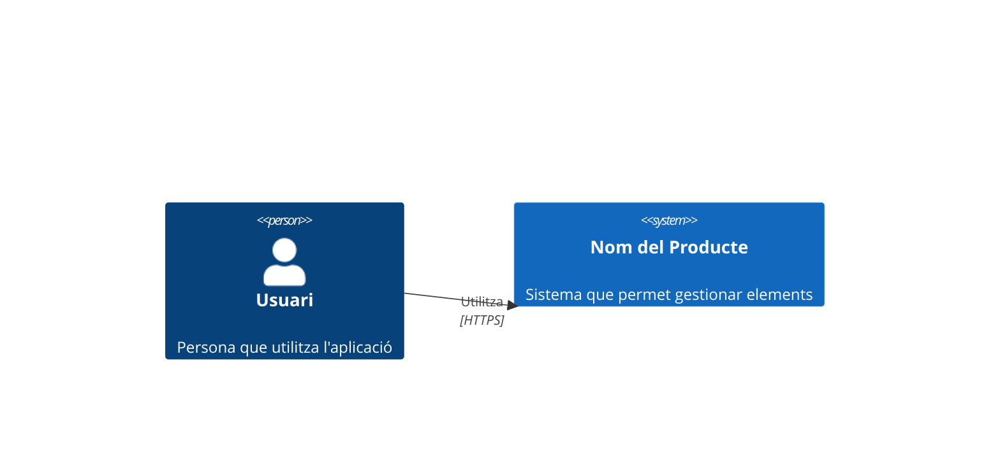
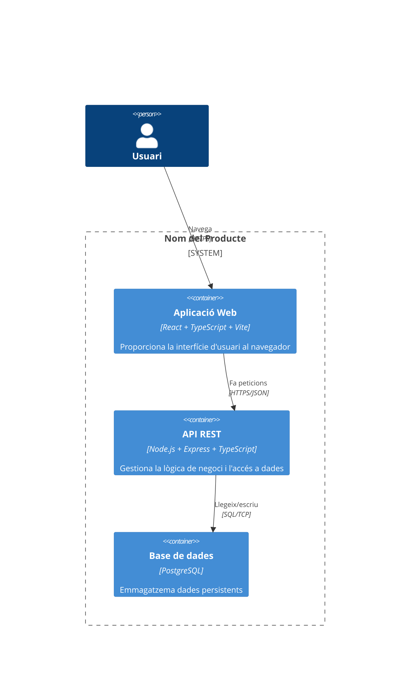
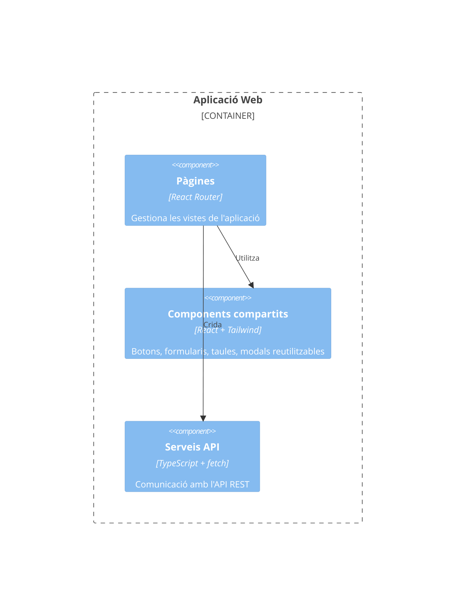
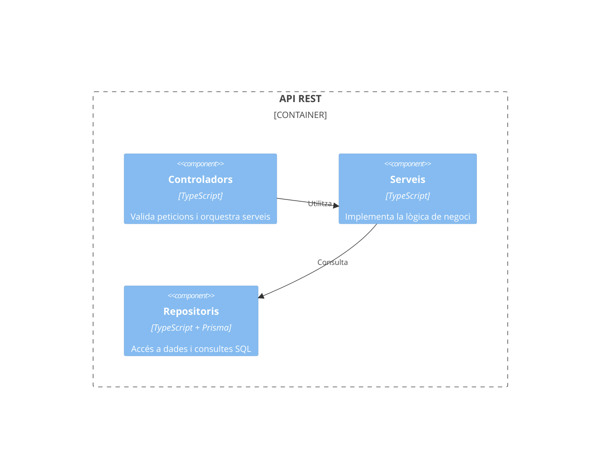
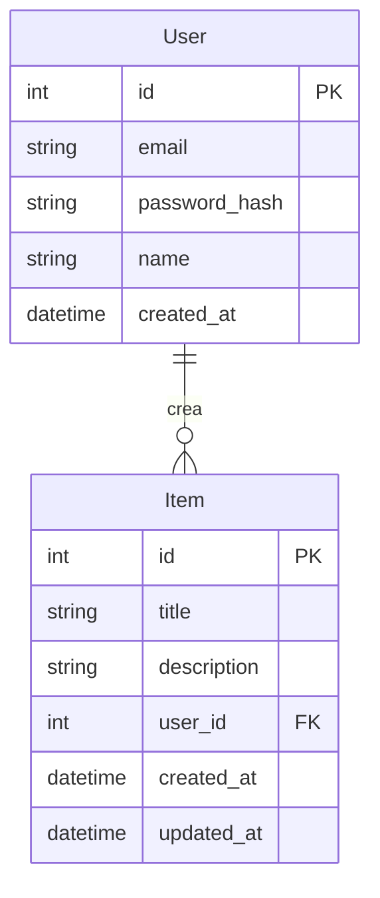

# Memòria del Projecte — Nom del Producte

**Curs:** 2025-2026 — LPS A5 Convocatòria Extraordinària
**Equip:** Nom de l'Equip
**Data:** 4 de juliol de 2026

---

## 1. Equip i rols

| Membre | Rol principal | Rols secundaris | Dedicació |
|--------|---------------|-----------------|-----------|
| Anna Martínez Pérez | Developer (backend) | Project Manager | 80% backend, 20% gestió |
| Bernat Gomila Serra | Developer (frontend) | - | 100% frontend |
| Carla Font Nadal | Developer (full-stack) | - | 100% full-stack |
| David Roca Amengual | Project Manager | Developer frontend | 60% gestió, 40% frontend |

**Mecanismes de coordinació:** Reunions diàries de 15 min (stand-up), Discord per comunicació asíncrona, GitHub Projects per gestió del backlog, _pair programming_ en mòduls crítics.

---

## 2. Producte

### 2.1 Context i motivació

[Descripció del problema que es vol resoldre. Context real o simulat.]

### 2.2 Stakeholders

[Identificació de les parts interessades en el producte i el que esperen obtenir-ne.]

### 2.3 Objectius

- **General:** [Objectiu principal del producte]
- **Específics (per _stakeholder_):**
  1. ...
  2. ...
  3. ...

### 2.3 Tipologia

- **Tipus:** [Aplicació web / aplicació mòbil / videojoc / ...]
- **Eina de gestió:** GitHub Projects

---

## 3. Descomposició en user stories / casos d'ús

### 3.1 Llista de user stories o casos d'ús

| ID | Nom | Descripció | Criteri d'acceptació |
|----|-----|------------|----------------------|
| US-01 | ... | Com a ... vull ... per tal de ... | ... |
| US-02 | ... | Com a ... vull ... per tal de ...| ... |
| ... | ... | ... | ... |

### 3.2 Justificació de prioritats

Les user stories s'han prioritzat utilitzant el mètode MoSCoW:

- **Must have (US-01 a US-07):** Funcionalitats essencials per al funcionament del producte. Sense aquestes, el producte no té valor.
- **Should have (US-08, US-10):** Funcionalitats importants però no crítiques. S'ha optat per versions reduïdes.
- **Could have (US-09):** Funcionalitat prescindible donat el temps disponible. Es deixa com a treball futur.

---

## 4. Requisits no funcionals

| ID | Nom | Descripció | Criteri de verificació |
|----|-----|------------|----------------------|
| RNF-01 | Temps de resposta | Les peticions HTTP han de respondre en menys de 2s | Test de càrrega amb 50 usuaris concurrents |
| RNF-02 | Persistència de dades | Les dades no es perden en cas de reinici del servidor | Prova d'aturada i reinici del contenidor |
| ... | ... | ... | ... |

---

## 5. Disseny del producte — Model C4

### 5.1 Nivell 1 — System Context

*Alternativament, representació en Mermaid:*

El sistema interactua amb un únic tipus d'usuari (l'usuari final) i no depèn de sistemes externs més enllà del servei d'autenticació de tercers (Supabase Auth).

### 5.2 Nivell 2 — Container

**Descripció dels contenidors:**

| Contenidor | Responsabilitat | Tecnologia |
|------------|----------------|------------|
| Aplicació Web | Interfície d'usuari SPA. Gestiona routing, estat, i comunicació amb l'API | React 18, TypeScript, Vite, Tailwind CSS |
| API REST | Lògica de negoci, validació, autenticació, accés a dades | Node.js, Express, TypeScript, JWT |
| Base de dades | Emmagatzematge persistent de dades d'usuaris i elements | PostgreSQL 16 |

### 5.3 Nivell 3 — Component

#### 5.3.1 Aplicació Web (Frontend)

**Descripció dels components del frontend:**

| Component | Responsabilitat |
|-----------|----------------|
| Pàgines | Vistes principals (Login, Dashboard, Llistat, Detall, Formulari). Cada pàgina orquestra components compartits i serveis. |
| Components compartits | Elements UI reutilitzables: Taula genèrica (amb ordenació i filtrat), Formulari amb validació, Modal de confirmació, Barra de navegació, Indicador de càrrega |
| Serveis API | Capa d'accés a l'API. Cada mètode correspon a un endpoint REST. Gestiona peticions, errors i transformació de dades. |

#### 5.3.2 Aplicació web (Backend)

**Descripció dels components del backend:**

| Component | Responsabilitat |
|-----------|----------------|
| Controladors | Rep la petició ja validada, invoca el servei corresponent i retorna la resposta HTTP. |
| Serveis | Conté la lògica de negoci: comprovació de permisos, càlculs, transformació de dades, regles de negoci. |
| Repositoris | Capa d'abstracció de base de dades. Implementa consultes CRUD i consultes específiques. |

#### 5.3.3 Base de dades

| Component | Responsabilitat |
|-----------|----------------|
| Schema | Definició de taules, relacions, índexs i restriccions (Prisma schema) |

**Model de dades:**

---

## 6. Resultats i conclusions

### 6.1 Producte desenvolupat

S'ha desenvolupat una aplicació web funcional que permet la gestió d'elements amb les següents funcionalitats operatives:

- **Registre i autenticació d'usuaris** (US-01, US-02): completament funcional amb verificació per email.
- **Gestió de perfils** (US-03): edició de nom i preferències.
- ...

**No s'ha implementat:**
- Notificacions push (US-09): es va prioritzar en darrer lloc i no va donar temps.

### 6.2 Justificació de l'abast

Durant la planificació vam establir que l'objectiu mínim era tenir un CRUD complet amb autenticació (7 user stories Must have). Aquest objectiu s'ha assolit completament. Les funcionalitats Should have s'han abordat en versions parcials, i la Could have (notificacions) s'ha deixat per a treball futur. Considerem que l'abast és adequat per a un sprint de dues setmanes amb un equip de 4 persones.

### 6.3 Contribució per desenvolupador a cada component

#### Contenidor Frontend (Pàgines, Components, Serveis, Context, Auth, Routing)

| Membre | Contribució | Component |
|--------|-------------|-----------|
| Anna Martínez | 15h | Components |
| Anna Martínez | 5h | Pages |
| Bernat Gomila | 4h | Pages |
| Bernat Gomila | 4h | Services |
| ...  | ... | ... |

#### Contenidor Backend (Rutes, Controladors, Serveis, Repositoris, Middleware, Validadors)

| Membre | Contribució | Component |
|--------|-------------|-----------|
| Anna Martínez | 4h | Controllers |
| Anna Martínez | 2h | Repositories |
| Bernat Gomila | 10h | Services |
| ... | ... | ... |

#### Contenidor Base de dades (Schema, Migracions, Seeds)

| Membre | Contribució | Tasques principals |
|--------|-------------|--------------------|
| David Roca | 5h | Schema |
| ... | ... | ... |

### 6.4 Contribució a la gestió del backlog

| Membre | Contribució | Tasques principals |
|--------|-------------|-------------------|
| Anna Martínez | 2h | Descomposició de tasques tècniques, revisió de PRs |
| Bernat Gomila | 2h | Definició de criteris d'acceptació, testing manual |
| ... | ... | ... |

### 6.5 Lliçons apreses

**Què ha funcionat bé:**
- La divisió clara entre frontend i backend ha permès treballar en paral·lel sense conflictes.
- Les reunions diàries de 15 minuts han mantingut l'equip alineat.
- L'ús de TypeScript ha reduït errors d'integració.
- La priorització MoSCoW va ajudar a centrar-se en el que era essencial.

**Què es podria millorar:**
- La definició de les user stories al principi era massa vaga; vam haver de redefinir criteris d'acceptació a mig sprint.
- La compartició d'elements va requerir més temps del previst perquè no vam considerar els casos d'usuari múltiples.
- El testing manual va consumir molt temps; un test automatitzat hauria estat més eficient.
- La comunicació asíncrona per Discord va generar alguns malentesos; hauríem d'haver establert horaris de disponibilitat més clars.
