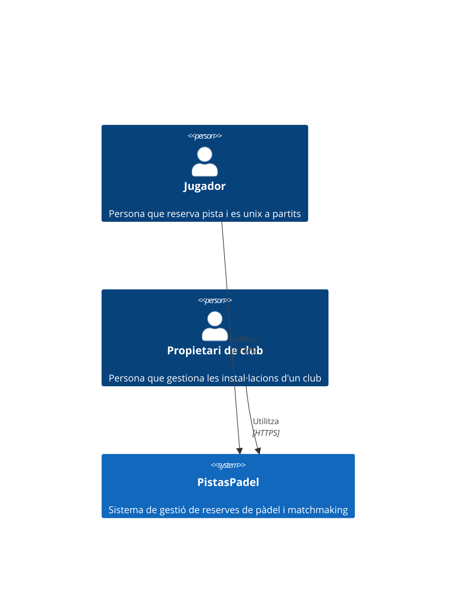
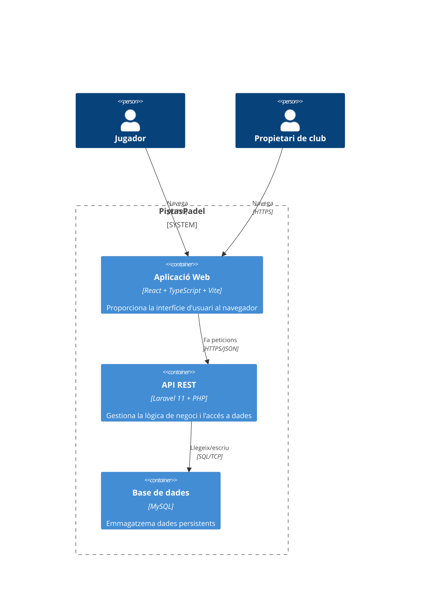
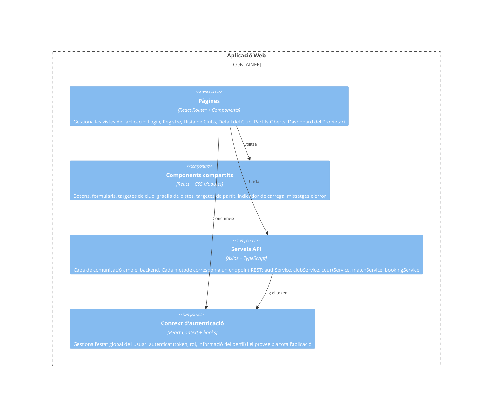
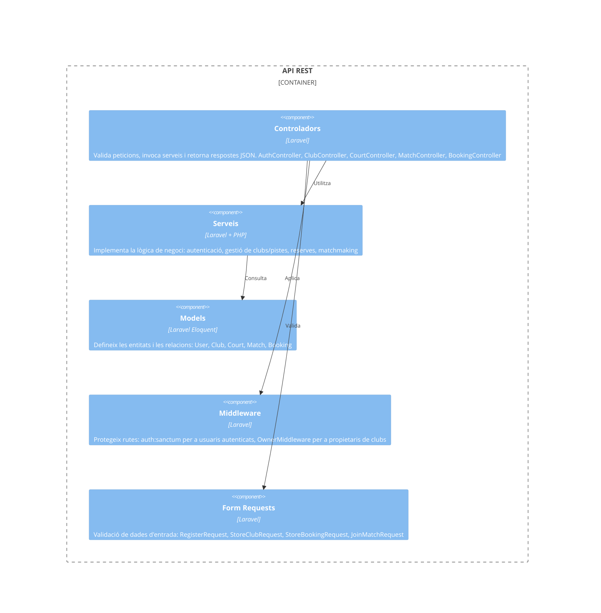
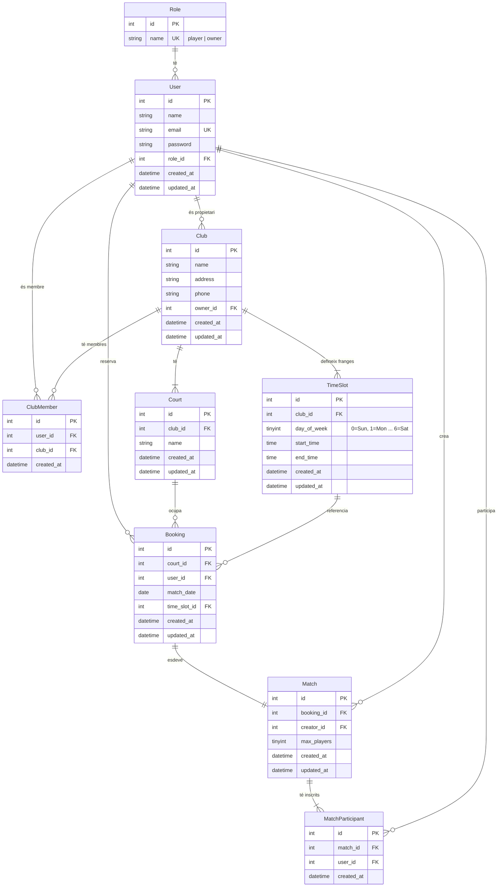

# Memòria del Projecte — PistasPadel

**Curs:** 2025-2026 — LPS A5 Convocatòria Extraordinària
**Equip:** Equip 2
**Data:** 5 de juliol de 2026

---

## 1. Equip i rols

| Membre | Rol principal | Rols secundaris | Dedicació |
|--------|---------------|-----------------|-----------|
| Lasha Bakhutashvili | [Per definir] | [-] | [Pendent] |
| Michael Cataño | [Per definir] | [-] | [Pendent] |
| Rafel Crespí | [Per definir] | Project Manager | [Pendent] |
| Pere Antoni Prats | Project Manager | Backend | [Pendent] |
| Sebastián Serra | [Per definir] | [-] | [Pendent] |

**Mecanismes de coordinació:** Reunions diàries de 15 min (stand-up), Discord per comunicació asíncrona, GitHub Projects per gestió del backlog, pair programming en mòduls crítics.

---

## 2. Producte

### 2.1 Context i motivació

El producte neix de la necessitat de gestionar reserves de pistes de pádel d'una forma senzilla i centralizada. Actualment, molts clubs gestionen les reserves de forma manual o amb eines disperses (WhatsApp, trucades, paper), cosa que genera errors, sobre-reserves i mala experiència per als jugadors. A més, els jugadors individuals tenen dificultats per trobar partits oberts si no tenen un grup fix.

PistasPadel vol resoldre aquests problemes oferint una plataforma on:
- Els **jugadors** puguin buscar clubs, veure disponibilitat de pistes i reservar franjes horàries, així com unir-se a partits oberts.
- Els **propietaris de clubs** puguin gestionar les seves instal·lacions (pistes, horaris) i visualitzar les reserves de forma clara.

### 2.2 Stakeholders

| Stakeholder | Expectatives |
|-------------|-------------|
| Jugadors de pádel | Poder reservar pista fàcilment, veure disponibilitat en temps real, i unir-se a partits oberts sense necessitat de tenir un grup. |
| Propietaris/gestors de clubs | Gestionar els horaris i pistes del seu club, veure l'estat de les reserves, i reduir la carga administrativa manual. |

### 2.3 Objectius

- **General:** Desenvolupar una aplicació web funcional que permeta la gestió de reserves de pàdel i la inscripció en partits oberts, tant per a jugadors com per a propietaris de clubs.
- **Específics (per stakeholder):**
  1. **Jugadors:** Poder registrar-se, autenticar-se, buscar clubs, veure horaris de pistes, reservar una franja horaria i apuntar-se a partits oberts.
  2. **Propietaris de clubs:** Poder registrar el seu club, donar d'alta/modificar/eliminar pistes, definir horaris disponibles i consultar les reserves rebudes.

### 2.4 Tipologia

- **Tipus:** Aplicació web (Single Page Application)
- **Stack tecnològic:** Laravel 11 (backend) + React + Vite (frontend) + MySQL (base de dades)
- **Desplegament:** Docker Compose (frontend + backend + base de dades)
- **Eina de gestió:** GitHub Projects

---

## 3. Descomposició en user stories / casos d'ús

### 3.1 Llista de user stories o casos d'ús

| ID | Nom | Descripció | Criteri d'acceptació |
|----|-----|------------|----------------------|
| US-01 | Autenticació i control de sessió | Com a jugador o propietari de club, vull registrar-me i iniciar sessió a la plataforma per poder gestionar les meves reserves i/o instal·lacions. | Les contrasenyes s'encripten amb Bcrypt. Un usuari no autenticat no pot accedir a pantalles protegides. L'API retorna un token (Sanctum) per identificar l'usuari. |
| US-02 | Visualització de clubs i horaris + creació de reserves | Com a jugador, vull veure els clubs disponibles i seleccionar-ne un per consultar les seves pistes i franges horàries lliures, i reservar una franja que estigui disponible. | El sistema mostra una llista de clubs. En seleccionar un club, es mostren les pistes i les franges del dia seleccionat. Les franges ocupades apareixen deshabilitades. El backend denega amb HTTP 422 si dos usuaris reserven la mateixa franja simultàniament. |
| US-03 | Inscripció asíncrona a partits oberts | Com a jugador individual, vull veure la llista de partits creats per altres i unir-me a un si queden places, per poder jugar encara que no tingui un grup complet. | Cada partit mostra creador, hora i places restants (ex. "3/4"). Si l'usuari ja hi pertany, el botó canvia a "Sortir del partit". Si l'aforo està ple, el botó d'unir-se es bloqueja. |
| US-04 | Gestió de clubs i instal·lacions (propietari) | Com a propietari d'un club de pàdel, vull registrar-me, donar d'alta les meves instal·lacions (pistes amb horaris) i consultar les reserves, per gestionar el meu negoci des de l'aplicació. | El propietari es registra amb un rol específic. Pot crear, modificar i eliminar pistes associades al seu club. Pots veure un dashboard amb les reserves de totes les pistes en un calendari. Només el propietari pot gestionar el seu club. |

### 3.2 Justificació de prioritats

Les user stories s'han prioritzat utilitzant el mètode MoSCoW:

- **Must have (US-01, US-02, US-03):** Funcionalitats essencials per al funcionament bàsic del producte. Sense autenticació, reserves o inscripció a partits, el producte no té valor per als jugadors.
- **Should have (US-04):** Funcionalitat important per al model de negoci (clubs com a oferta de pistes), però no bloquegen el flux bàsic de jugador. Es desenvoluparà si el temps ho permet.
- **Could have:** Cancel·lació de reserves, historial de partits, edició de perfil. Queden per a treball futur.

---

## 4. Requisits no funcionals

| ID | Nom | Descripció | Criteri de verificació |
|----|-----|------------|----------------------|
| RNF-01 | Temps de resposta | Les peticions HTTP han de respondre en menys de 2s en condicions normals d'ús | Test de càrrega amb 50 usuaris concurrents simulant peticions a l'API |
| RNF-02 | Persistència de dades | Les dades no es perden en cas de reinici del servidor o dels contenidors Docker | Prova d'aturada i reinici dels contenidors: les dades han de mantenir-se |
| RNF-03 | Seguretat de contrasenyes | Les contrasenyes s'emmagatzemen amb hash Bcrypt, mai en text pla | Inspecció directa a la BD: el camp password ha de contenir un hash de 60 caràcters |
| RNF-04 | Autenticació per token | L'API utilitza tokens Sanctum per protegir endpoints privats. Un endpoint protegit ha de retornar 401 si no es proporciona un token vàlid | Test d'endpoint protegit sense token: ha de retornar 401; amb token vàlid: ha de retornar 200 |
| RNF-05 | Control de concurrència en reserves | El sistema ha d'evitar que dos usuaris reservin la mateixa franja horària alhora | Dos POSTs simultanis al mateix slot: el primer rep 201, el segon rep 422 |
| RNF-06 | Interfície responsive | La interfície ha de ser utilitzable tant en dispositius mòbils com en escriptori | Inspecció visual en viewports de 375px i 1280px: tots els elements han de ser accessibles |
| RNF-07 | Desplegament reproducible | L'entorn complet ha d'aixecar-se amb un sol `docker compose up` sense configuracions manuals addicionals | Execució en una màquina neta sense cap eina instal·lada prèviament (només Docker) |
| RNF-08 | Separació per rols | Un usuari amb rol "player" no pot accedir a funcionalitats de propietari i viceversa | Test de permisos: un player no pot crear/editar clubs; un owner no pot reservar pistes |

---

## 5. Disseny del producte — Model C4

### 5.1 Nivell 1 — System Context

### 5.2 Nivell 2 — Container

**Descripció dels contenidors:**

| Contenidor | Responsabilitat | Tecnologia |
|------------|----------------|------------|
| Aplicació Web | Interfície d'usuari SPA. Gestiona routing, estat i comunicació amb l'API | React 18, TypeScript, Vite |
| API REST | Lògica de negoci, validació, autenticació, accés a dades | Laravel 11, PHP 8.x, Sanctum |
| Base de dades | Emmagatzematge persistent de dades | MySQL 8 |

### 5.3 Nivell 3 — Component

#### 5.3.1 Aplicació Web (Frontend)

**Descripció dels components del frontend:**

| Component | Responsabilitat |
|-----------|----------------|
| Pàgines | Vistes principals: `LoginPage`, `RegisterPage` (autenticació), `ClubListPage`, `ClubDetailPage` (reserves), `MatchListPage` (partits oberts), `OwnerDashboardPage` (gestió del club). Cada pàgina combina components compartits i crides als serveis. |
| Components compartits | Elements UI reutilitzables: `Navbar`, `ClubCard`, `CourtSlot` (graella de pistes amb franges), `MatchCard` (targeta de partit), `LoadingSpinner`, `ErrorMessage`. |
| Serveis API | Capa d'accés al backend amb Axios. Gestiona la inclusió del token d'autenticació als headers, la transformació de dades i el tractament d'errors HTTP. |
| Context d'autenticació | Guarda l'usuari i el token al context de React. En iniciar sessió, desa el token al localStorage per persistir la sessió entre recàrregues. |

#### 5.3.2 API (Backend)

**Descripció dels components del backend:**

| Component | Responsabilitat |
|-----------|----------------|
| Controladors | Rep la petició validada, invoca el servei corresponent i retorna la resposta HTTP. Cada controlador gestiona un recurs: `AuthController` (register, login, logout), `ClubController` (CRUD de clubs), `CourtController` (CRUD de pistes), `MatchController` (llista, crear, join, leave), `BookingController` (crear reserves). |
| Serveis | Conté la lògica de negoci: comprovació de permisos (que l'usuari sigui propietari del club), control de concurrència en reserves, validació d'aforament en partits, càlcul de places restants. |
| Models | Capa d'abstracció de base de dades amb Eloquent. Defineix les relacions: Club pertany a User (owner), Court pertany a Club, Booking pertany a Court i a User, Match pertany a User (creator) i té molts Users (pivot). |
| Middleware | `auth:sanctum` per a rutes protegides. `OwnerMiddleware` personalitzat que verifica que l'usuari autenticat sigui el propietari del club sobre el qual s'està operant. |
| Form Requests | Classes de validació que asseguren que les dades d'entrada siguin correctes abans d'arribar al controlador. |

#### 5.3.3 Base de dades

L'esquema de la base de dades consta de 9 taules dissenyades seguint la Forma Normal de Boyce-Codd (FNBC), on cada determinant és una clau candidata i s'han eliminat les dependències funcionals no trivials:

**Descripció de les taules:**

| Taula | Responsabilitat |
|-------|----------------|
| roles | Catàleg de rols del sistema: `player` i `owner`. Separar-ho en taula pròpia permet afegir nous rols sense modificar l'esquema. |
| users | Usuaris del sistema (jugadors i propietaris). Cada usuari té un rol assignat via FK a `roles`. L'email és únic i s'usa com a identificador d'inici de sessió. |
| clubs | Clubs de pádel. Cada club pertany a un únic propietari (FK a users). El propietari pot gestionar les pistes i veure les reserves. |
| club_members | Taula pivote que permet que un jugador sigui membre de múltiples clubs. La combinació `(user_id, club_id)` és única. |
| time_slots | Defineix les franges horàries disponibles per a cada club, segmentades per dia de la setmana. Exemple: dilluns 09:00-10:30, 10:30-12:00. Un club pot tenir franges diferents cada dia. |
| courts | Pistes d'un club. Cada pista pertany a un club i té un nom descriptiu (ex. "Pista Central", "Pista 1"). La combinació `(club_id, name)` és única. |
| bookings | Reserves de pistes. Una reserva vincula un usuari amb una pista en una data i franja horària (referenciada a `time_slots`). La UK `(court_id, match_date, time_slot_id)` garanteix FNBC i evita dobles reserves de forma nativa. |
| matches | Partits oberts. Cada match té una relació 1:1 amb una booking (`booking_id` és UK), el que significa que un partit sempre ocupa una reserva de pista. El `creator_id` és l'usuari que crea el partit (normalment el mateix que fa la booking). |
| match_participants | Inscripcions de jugadors a partits. La FK a `matches` i la UK `(match_id, user_id)` garanteixen que un usuari només es pugui inscriure una vegada al mateix partit. |

---

## 6. Resultats i conclusions

### 6.1 Producte desenvolupat

[Pendent d'omplir]

### 6.2 Justificació de l'abast

[Pendent d'omplir]

### 6.3 Contribució per desenvolupador a cada component

#### Contenidor Frontend

| Membre | Contribució | Component |
|--------|-------------|-----------|
| [Nom] | [h] | [Component] |

#### Contenidor Backend

| Membre | Contribució | Component |
|--------|-------------|-----------|
| [Nom] | [h] | [Component] |

#### Contenidor Base de dades

| Membre | Contribució | Tasques principals |
|--------|-------------|--------------------|
| [Nom] | [h] | [Tasques] |

### 6.4 Contribució a la gestió del backlog

| Membre | Contribució | Tasques principals |
|--------|-------------|-------------------|
| [Nom] | [h] | [Tasques] |

### 6.5 Lliçons apreses

[Pendent d'omplir]